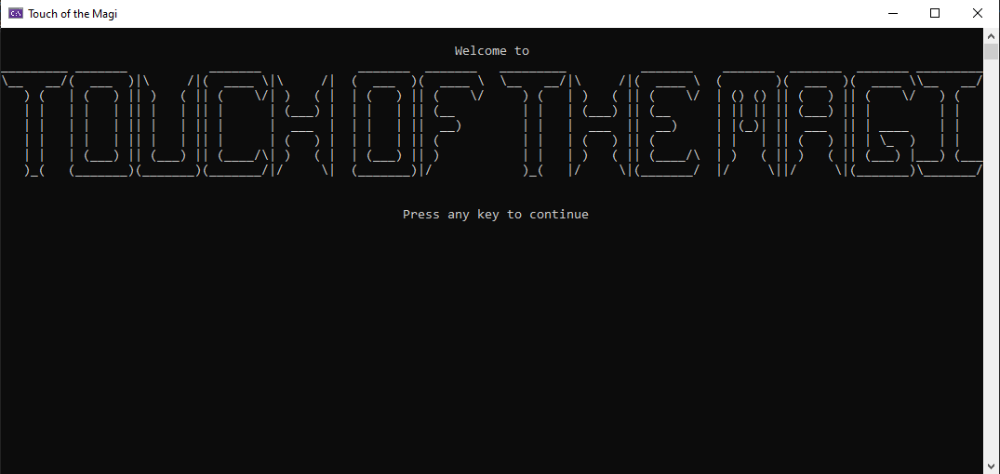

# Programming portfolio

## Adventure Game / Touch of the Magi

Touch of the Magi is my [Adventure Game](https://github.com/Yorklag/TouchOfTheMagi)

## Study Program
A [Study program](https://github.com/Yorklag/StudyApp) that lists terms and gets answers in a multiple choice format

## Explorable Areas
We did this as a class and made an adventure leading to candy mountain

## Underwater Creatures
Also did this as a class and made several different fish that were able to eat as well as several different items including food and trash

## Adopt-An-Insect
A small program that was used to learn putting objects into lists letting a player pick an insect to add to a list of insects they own

## Shift Cipher
A program allowing the user to encode and decode a string using an alphabet shift cipher

## Trivia Game
A [quick game of trivia](https://github.com/Yorklag/Trivia) that asks the players questions and tells them the answer to ones of questions. created for a test of player input usage and validation.

Layout for page inspired by Janell Baxter